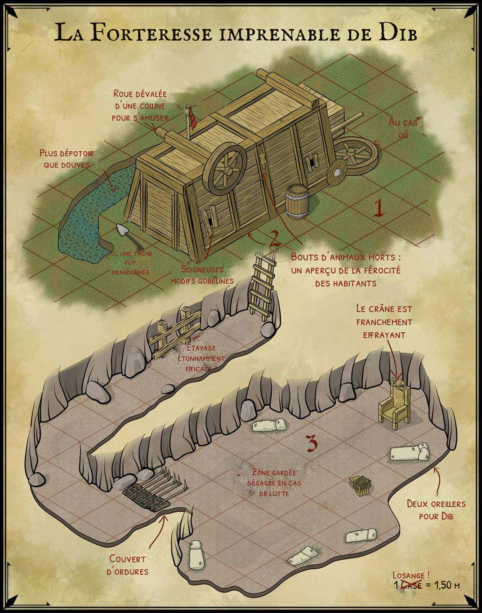
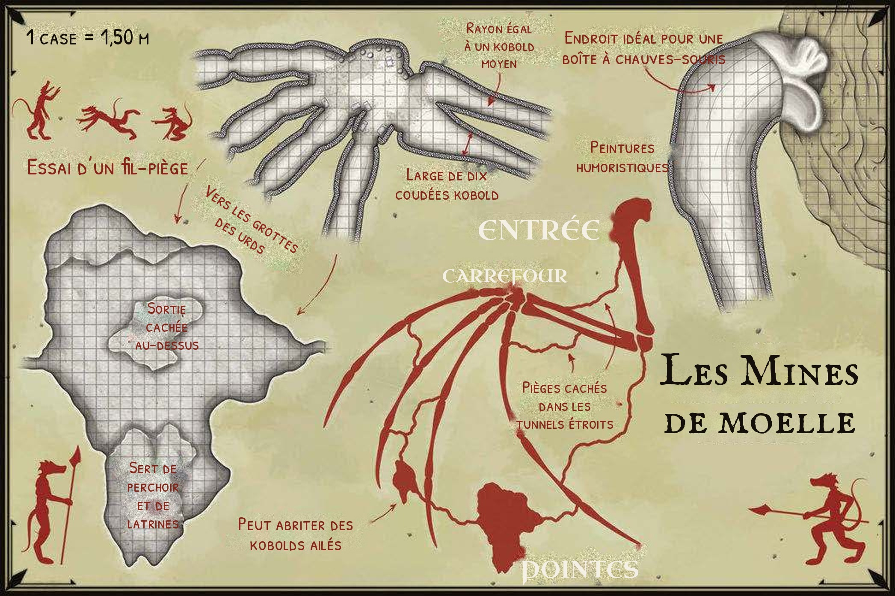

_D'après « Prepared! A Dozen Adventures for Fifth Edition » de Jon Sawatsky (Kobold Press / Open Design, 2016). Adaptation non officielle pour Shadowdark RPG, pour usage personnel._

Miette la Ricoche - Halfelin édenté et tatoué
Gicien le Nain
Corimbe, pretresse => Morte dans un flamboyant éclat

## Notes d'adaptation

- **Niveau visé :** personnages de **niveau 0** (entonnoir, 6 à 10 personnages) ou **niveau 1** (4 à 5 personnages). Quand un nombre est donné sous la forme « 3 (5) », utilisez le premier pour le niveau 0 et le second pour le niveau 1.
- **Tests :** pas de compétences. Les tests se font sur une caractéristique contre un DD : **9** (facile), **12** (normal), **15** (difficile), **18** (extrême). Si les joueurs décrivent une action pertinente (sonder le sol avec une perche, fouiller sous le trône), ils réussissent **sans jet**.
- **Distances :** _au contact_ (1,50 m), _proche_ (jusqu'à 9 m), _loin_ (à portée de vue).
- **Lumière :** une torche éclaire à distance _proche_ et dure **1 heure en temps réel**. Les zones souterraines sont plongées dans le noir total.
- **Rencontres aléatoires :** dans les zones souterraines (danger _risqué_), lancez 1d6 tous les 2 tours d'exploration ; une rencontre survient sur un 1.
- **Moral :** quand un groupe d'ennemis perd la moitié de ses membres (ou un chef la moitié de ses PV), il fuit sauf s'il réussit un test de SAG DD 15.
- **XP :** les trésors indiquent leur valeur d'XP (pauvre 0, normal 1, fabuleux 3, légendaire 10).
- **Profils :** les profils ci-dessous sont des versions maison, calibrées pour des personnages fragiles, au format Shadowdark. Remplacez-les par ceux du livre de base si vous préférez.

---

## La forteresse imprenable de Dib

**Personnages de niveau 0 à 1 — extérieur (sûr) puis souterrain (risqué)**

> _Nous suivions la vieille route commerciale, près des collines Aveugles, quand nous l'avons trouvé : un chariot renversé dans le fossé. Evas s'est glissé dans l'ombre et il est revenu avec d'étranges détails. Le chariot avait été transformé en une sorte de forteresse hargneuse : des boucliers brisés renforçaient les parois, des meurtrières grossières étaient taillées dans le banc du cocher et un drapeau pendait mollement au sommet. Nous l'avons laissé tranquille, mais même de loin, la puanteur de ses douves inachevées nous soulevait le cœur…_

### Historique

Il y a quelques mois, Dib Mâcheur-de-Halfelins et ses acolytes ont été chassés de leur clan gobelin parce qu'ils se battaient à la lutte contre tout et n'importe qui. Après quelques nuits d'errance, la bande a trouvé un chariot abandonné au bord de la route et l'a transformé en forteresse gobeline. Depuis, elle détrousse les voyageurs isolés.

**Rumeurs (1d4)**

1. « Un marchand de sel a disparu sur la vieille route. On n'a retrouvé que sa mule, rasée. » _(vrai)_
2. « Le chariot est hanté : il crache de l'huile bouillante tout seul. » _(à moitié vrai)_
3. « Le chef gobelin porte une couronne de diamants. » _(faux : c'est un caillou brillant, et le vrai losange est dessiné sur la carte)_
4. « Ils ont creusé un tunnel jusqu'aux Profondeurs. » _(faux, pour l'instant)_

### Profils

**Gobelin** — CA 11, PV 4, ATQ 1 lance +0 (1d4) ou 1 arc court (loin) +1 (1d4), DÉP proche, FOR +0 DEX +1 CON +0 INT −1 SAG −1 CHA −2, AL C, NV 1. _Lutteur._ Avantage aux tests pour agripper ou renverser.

**Dib Mâcheur-de-Halfelins** — CA 12, PV 8, ATQ 1 clé de genou +1 (1d4 + agrippé) ou 1 épée courte +1 (1d6), DÉP proche, FOR +1 DEX +1 CON +1 INT −1 SAG −1 CHA +0, AL C, NV 2. _Clé de genou._ La cible agrippée ne peut ni se déplacer ni attaquer. Elle peut se libérer au prix de son action avec un test de FOR ou DEX DD 12. Tant qu'il maintient la prise, Dib ne se déplace pas. _Fanfaron._ Si Dib tombe à 0 PV, les gobelins survivants fuient sans test de moral.

### La forteresse (rencontre de combat)

La forteresse agit comme une créature à l'initiative 10 et effectue **une** action par tour (**deux** contre des personnages de niveau 1) :

- **Salve de flèches :** +1 contre deux cibles à portée _loin_, 1d4 dégâts chacune.
- **Coups de lance :** +1 contre deux cibles _au contact_, 1d4 dégâts chacune. Avantage contre les personnages qui soulèvent le chariot.
- **Huile assez chaude (1 fois sur 2) :** toutes les créatures à portée _proche_ font un test de DEX DD 12. En cas d'échec, elles subissent 1 dégât et leur torche s'éteint si elles en portent une.

### Venir à bout de la forteresse

- **La démolir :** CA 12, PV 15 (25). Les armes perforantes infligent 1 dégât seulement. À 0 PV, les gobelins fuient vers la zone 3.
- **Enfoncer la porte :** test de FOR DD 15, qui passe à DD 12 si la forteresse a perdu la moitié de ses PV. Les gobelins fuient vers la zone 3.
- **Soulever tout ce fichu machin :** il faut réussir un test de FOR DD 15 pendant 2 tours consécutifs. Chaque personnage qui aide (jusqu'à 4) apporte +1 et ne peut rien faire d'autre ce tour-là. Un échec au 2ᵉ tour oblige à tout recommencer. En cas de réussite, les gobelins fuient vers la zone 3.
- **Le feu :** chaque torche lancée sur le chariot a 1 chance sur 2 de l'embraser (1-3 sur 1d6). Une fois en feu, le chariot perd 1d6 PV par tour, et les gobelins fuient au bout de 2 tours.
- **Ruse :** les gobelins sont bêtes et vaniteux. Un défi à la lutte, lancé avec un test de CHA DD 12, fait sortir Dib en personne.

### Carte

### Zone 1 : l'extérieur

> _Un grand chariot de bois gît renversé à quelques pas de la route. Des douves inachevées, remplies d'une boue gélatineuse, l'entourent ; leur puanteur vous prend à la gorge à cinquante pas. Des boucliers brisés et des planches récupérées renforcent les parois, et un renard mort est cloué au-dessus d'une porte grossière. Des chuchotements et des bruissements s'échappent des meurtrières. Un drapeau en chiffons pend, immobile._

- **Les douves :** les traverser à pied prend un tour entier. Un personnage qui échoue à un test de CON DD 9 vomit et perd son prochain tour.
- **La pelle abandonnée** fait un levier idéal : avantage pour soulever le chariot.
- **La roue de secours** peut servir de bouclier (+1 CA, un seul coup, encombrante).

### Zone 2 : sous le chariot (obscurité)

> _L'intérieur est humide et nauséabond. Un petit chaudron de graisse bouillonne sur un feu enfumé qui éclaire à peine. Des lances de mauvaise facture traînent au sol. Une échelle descend dans un trou._

Un sac graisseux est caché sous une pierre. Les joueurs le trouvent s'ils fouillent, ou avec un test de SAG DD 9. Il contient **25 pa et quelques cailloux brillants** (trésor pauvre, 0 XP). Le chaudron de graisse peut être renversé sur des poursuivants : tous ceux qui se trouvent _au contact_ font un test de DEX DD 12 ou subissent 1d4 dégâts.

### Zone 3 : tunnel et salle du trône (obscurité, danger risqué)

> _Le tunnel, grossièrement étayé, file tout droit avant de tourner sèchement. Au-delà, une torche crachotante éclaire une petite salle et un trône de bric et de broc surmonté d'un crâne. Des yeux luisent derrière des tas de terre et de paillasses. Vous entendez des cordes d'arc se tendre._

Les **4 (5) gobelins** tirent à l'arc depuis leurs tas de terre, qui imposent un désavantage aux attaques à distance contre eux, jusqu'à ce qu'on vienne les chercher au corps à corps. **Dib** attend sur son trône et se jette sur le premier personnage qui s'approche.

- **Piège à pointes (couvert d'ordures)** à l'entrée de la salle. Il est repéré si les joueurs sondent le sol ou fouillent les ordures, sinon avec un test de SAG DD 12. Le désamorcer demande un test de DEX DD 12. S'il se déclenche, chaque personnage _au contact_ fait un test de DEX DD 12 ou subit 1d4 dégâts.
- **Éteindre la torche** de la salle plonge tout dans le noir. Les gobelins voient aussi mal que les humains.
- **Le trône :** son assise est branlante. Dessous se trouve un coffret contenant **60 pa, 15 po** et un chiffon couvert des plans de la forteresse de Dib (trésor normal, 1 XP).
- **Le crâne du trône** est franchement effrayant. C'est celui d'un ogre, qui vaut 10 po auprès d'un collectionneur (trésor normal, 1 XP).

### Rencontres aléatoires (1d6)

1. Deux gobelins reviennent d'un pillage avec une mule chargée de sel (valeur 20 po).
2. Un loup affamé, attiré par l'odeur des douves.
3. Des rats géants dans le tunnel (3).
4. Un marchand ligoté et bâillonné dans un fossé. Il promet 10 po de récompense.
5. Une torche s'éteint à cause d'un courant d'air venu du tunnel.
6. Silence : rien ne se passe, mais quelque chose gratte sous le sol…

### Conclusion

Les autorités locales seront reconnaissantes que la route soit dégagée. Mais d'où viennent les prises de lutte de Dib ? Peut-être que tout son clan pratique le combat à mains nues dans des arènes souterraines qui se multiplient, et qu'il a de plus en plus envie d'essayer ses prises sur les gens des villes.

---

## Les mines de moelle

**Personnages de niveau 0 à 1 — souterrain (danger risqué)**

> _Les chiens maléfiques m'ont enlevé alors que je campais près du marais d'Agav. Ils m'ont traîné dans leur repaire : une immense aile d'os enfouie dans le flanc d'une colline. Ils m'ont enchaîné dans le noir avec une chandelle de cire immonde et m'ont forcé à creuser la moelle. Leurs liens étaient mal faits, et j'ai fui pendant leur sommeil. Pourquoi extraient-ils cette moelle ? Je l'ignore…_

### Historique

Les mines sont creusées dans l'aile fossilisée d'un léviathan sans nom, tombé d'un ciel d'un autre monde. Une meute de kobolds y vit, drogués par la moelle, et patrouille les environs. La nuit, des **urds** (kobolds ailés) survolent le territoire. Ils nichent au fond des pointes de l'aile.

La meute est menée par **Rikir le Borgne**, une brute qui a perdu un œil face aux gobelins du coin. C'est lui qui a conçu les pièges des mines.

**Accroche pour des personnages de niveau 0 :** les personnages sont des villageois enlevés par les kobolds et enchaînés dans le carrefour (zone 2). Ils commencent sans équipement, avec une seule chandelle pour tout le groupe (lumière _au contact_, 1 heure). À la place de la moelle qu'ils doivent creuser, ils cherchent la sortie.

### Profils

**Kobold** — CA 12, PV 3, ATQ 1 lance +0 (1d4) ou 1 fronde (loin) +1 (1d4), DÉP proche, FOR −1 DEX +1 CON +0 INT −1 SAG +0 CHA −1, AL C, NV 0. _Meute._ Avantage à l'attaque si un autre kobold est _au contact_ de la même cible.

**Kobold marqué par la moelle** (1 kobold sur 5) — même profil que le kobold, PV 5, NV 1. _Visions du léviathan (1 fois par combat)._ Toutes les créatures à portée _proche_ qui croisent son regard font un test de SAG DD 12. En cas d'échec, elles voient un léviathan traverser un ciel d'orage et ne peuvent pas attaquer à leur prochain tour.

**Rikir le Borgne** — CA 13, PV 10, ATQ 1 hachette +2 (1d6), DÉP proche, FOR +2 DEX +0 CON +1 INT +1 SAG −1 CHA +0, AL C, NV 2. _Visions du léviathan_, comme le kobold marqué. _Borgne._ Il subit un désavantage à toute attaque venant de sa gauche.

**Urd** (kobold ailé) — CA 12, PV 4, ATQ 1 pierre lâchée +1 (1d4), DÉP proche (vol), FOR −1 DEX +2 CON +0 INT −1 SAG +0 CHA −1, AL C, NV 1. _Bombardier._ Il lâche ses pierres depuis le plafond, hors de portée des armes de corps à corps.

**Mille-pattes géant** — CA 11, PV 4, ATQ 1 morsure +1 (1d4 + poison), DÉP proche (escalade), FOR −1 DEX +1 CON +0 INT −4 SAG +0 CHA −4, AL N, NV 1. _Poison._ La cible fait un test de CON DD 9 ; en cas d'échec, elle ne peut pas se déplacer pendant 1 tour.

**Nuée de chauves-souris** — CA 12, PV 6, ATQ 1 nuée +1 (1d4), DÉP proche (vol), FOR −3 DEX +2 CON +0 INT −4 SAG +1 CHA −4, AL N, NV 1. _Tourbillon._ Chaque tour, une torche au contact de la nuée s'éteint sur 1-2 (1d6).

### Élément A : la moelle

Consommer la moelle provoque des visions de tempêtes et de monstres ailés. Le personnage fait un test de CON DD 15. En cas d'échec, il est **paralysé pendant 1d4 heures** et doit être porté. À la fin des visions, succès ou échec, il sait **lire, écrire et parler le draconique** jusqu'à la fin de son prochain repos… et le jet se refait chaque fois qu'il en reprend. La moelle a une grande valeur pour un alchimiste (voir _Trésor_).

### Élément B : les pièges de Rikir

- **Fosse aux mille-pattes.** _Le sol cède ; vous tombez sur un sol inégal où quelque chose grouille._ Un faux plancher recouvre une fosse de 3 m. La chute inflige 1d6 dégâts, puis **2 (3) mille-pattes géants** attaquent. Le piège est repéré si les joueurs sondent le sol, sinon avec un test de SAG DD 12. On peut ensuite le contourner.
- **Boîte à chauves-souris.** _Un claquement de fil sous votre pied, puis une rumeur d'ailes grandit dans les ténèbres._ Un fil de déclenchement ouvre une cage à 6 m de hauteur et libère **1 nuée de chauves-souris**. Il est repéré en éclairant le sol ou avec un test de SAG DD 12. On peut l'enjamber sans jet, ou le désamorcer avec un test de DEX DD 9.
- **Pièges supplémentaires (1d4)**, à placer où vous voulez :
    1. Un pot de moelle en équilibre au-dessus d'une porte. Test de DEX DD 12 pour l'éviter ; sinon, test de CON DD 12 contre les vapeurs ou désavantage pendant 1 heure.
    2. Une corde qui fait sonner des os et alerte toute la garenne.
    3. Un sol huilé en pente : test de DEX DD 9 ou le personnage glisse jusque dans la zone 3.
    4. Une fausse chandelle qui explose : 1d4 dégâts à tous ceux _au contact_.

### Carte

### Zone 1 : l'entrée

> _L'articulation d'une aile colossale saille du flanc de la colline. L'os a été évidé en tunnel ; ses parois sont couvertes de peintures au doigt montrant des humanoïdes à tête de chien. Des tas d'os et d'outils brisés encombrent l'entrée._

**2 kobolds sentinelles** montent la garde avec des sifflets qui émettent une note sinistre. S'ils sifflent, toute la garenne est en alerte : plus de surprise possible, et les kobolds se fortifient dans la zone 2. Les sentinelles sont nerveuses : un bruit étrange ou une lueur dans les buissons suffit à les éloigner de leur poste (test de CHA ou d'INT DD 9 selon la ruse).

Un **tunnel secret**, juste après l'entrée, mène directement à la zone 3. Les joueurs le trouvent en fouillant les parois ou avec un test de SAG DD 15.

### Zone 2 : le carrefour

> _Le tunnel débouche sur une grande salle irrégulière. Des pots de terre cramoisie s'alignent contre le mur est. Une immense peinture de créature ailée domine la pièce. Des couchettes en forme de nids jonchent le sol. Une odeur de cire brûlée flotte._

- **Si la garenne est alertée :** **4 (6) kobolds**, dont un marqué par la moelle, tirent à la fronde depuis l'entrée. **Rikir et 2 gardes** tirent depuis le fond de la salle. Quand les personnages entrent, les kobolds chargent pour protéger leur chef.
- **Sinon :** la moitié des kobolds dort (surprise possible), et l'autre moitié creuse la moelle.
- La moelle des pots est magique. Un test d'INT DD 9 révèle qu'il est probablement dangereux d'en consommer.
- **Chaînes de prisonniers** au mur (accroche pour des personnages de niveau 0). Les clés sont sur Rikir.

### Zone 3 : les pointes de l'aile

> _Le tunnel se rétrécit jusqu'à vous obliger à ramper. Au bout, il s'ouvre sur une vaste caverne. Le sol est couvert de fientes, et des froissements d'ailes résonnent dans le noir au-dessus de vous._

Les **3 (4) urds** nichent au plafond et bombardent les intrus de pierres. Ils ne consomment pas la moelle et méprisent les kobolds. Un personnage qui parle draconique, grâce à la moelle, peut négocier avec eux : ils guident le groupe jusqu'à la sortie contre la tête de Rikir. Ils fuient si on les éclaire vivement, par exemple avec plusieurs torches ou de l'huile enflammée.

### Trésor

|Objet|Où|XP|
|---|---|---|
|Magot de Rikir : 40 pa, 8 po, une bague de cuivre|Sous sa couchette (zone 2)|1|
|Pot de peinture de moelle : lueur cramoisie (lumière _au contact_, 1 jour), indélébile ; 25 po pour un alchimiste|Zone 2|1|
|Plume de léviathan, parfaitement préservée : sert de **bâton +1**, ou peut devenir un carquois de **flèches +1** chez un artisan|Au fond de la zone 3|3|

### Rencontres aléatoires (1d6)

1. Une patrouille de 2 kobolds traîne un prisonnier gémissant.
2. Une nuée de chauves-souris dérangée.
3. Un kobold drogué, paralysé par la moelle, marmonne en draconique. Il sait où se trouve le magot.
4. Un urd isolé qui cherche la bagarre.
5. Un courant d'air : une torche s'éteint sur 1-3 (1d6).
6. L'aile gronde et de la poussière tombe. Chacun fait un test de DEX DD 9 ou subit 1 dégât.

### Suites possibles

Le léviathan n'est peut-être pas entièrement mort. Plus on extrait de moelle, plus les visions deviennent précises et plus les orages sur la région redoublent. Quelque chose, là-haut, cherche son aile.

## FIN
Le chariot a explosé
Corimbe s'est sacrifiée
L'équipe gagne 1 XP avec le déplacement, et claque 100 PO dans une fête grandiose

Reste encore à explorer le caveau
